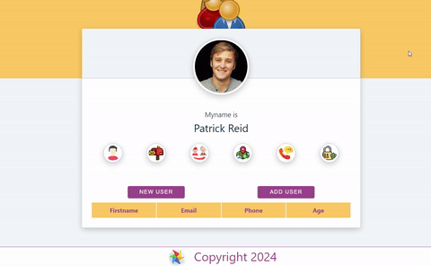

# Random-User-Generator-App

[Live Demo](https://random-user-generator-app.netlify.app/)

## Description

- This is a simple React application that generates random user information using the [Random User Generator API](https://randomuser.me/). The app displays a default user image along with various user details such as name, email, age, address, phone, and password. Additionally, it provides options to fetch a new random user or add the current user to a table.

## Project Skeleton

```
02 - Random User App
|
SOLUTION
├── public
│     └── index.html
├── src
│    ├── assets
│    │       └── [images]
│    ├── components
│    ├──     ├── Footer.css
│    │       └── Footer.jsx
│    ├── App.js
│    ├── index.css
│    └── index.js
├── gitignore
├── LICENSE
├── package-lock.json
├── package.json
└── README.md
```
## Outcome




## Objective

- Build a Random User App using ReactJS.
- The user details are displayed in a clean and visually appealing format.
- Click the "new user" button to fetch and display a new random user.
- Click the "add user" button to add the current user's information to the table


## Steps to Solution

- Step 1: Create React App using `yarn && yarn start` or `npm && npm install`.

- Step 2: Build Random User App fetching data from `https://randomuser.me/api/` using `fetch` or `axios`.
